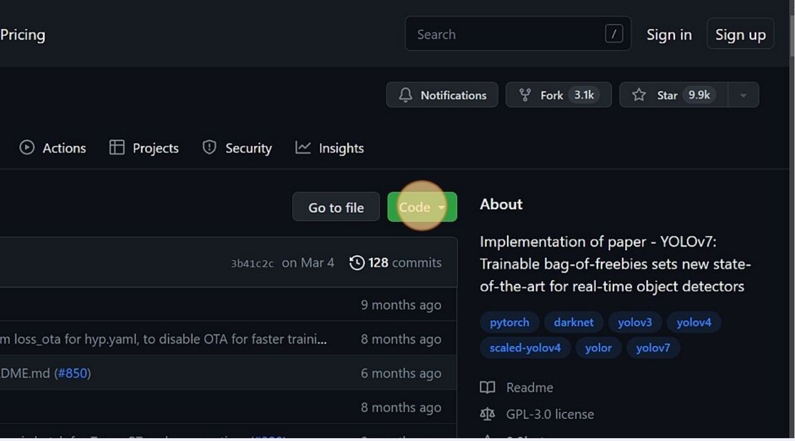
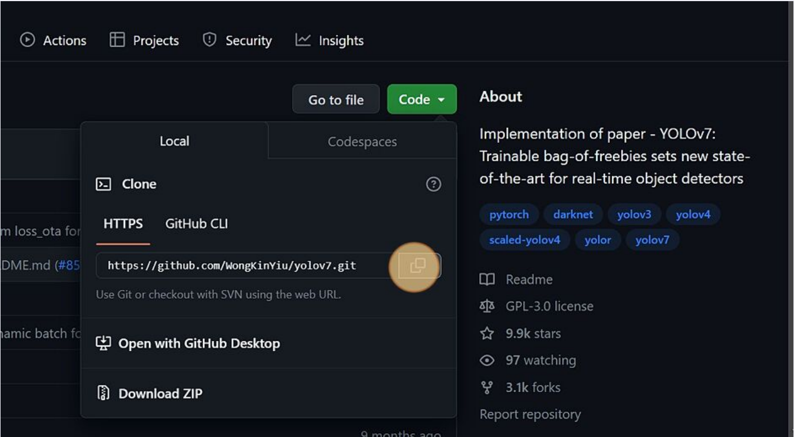

# YOLO (You Only Look Once)

YOLO (You Only Look Once) employs an end to end neurall netowkr to simultaneously predict bounding boxes and class probabilities, streamlining the object detection process. The innovative approach distinguishes it from tradtional methods, which typically repurpose classifiers for dtection tasks.

YOLO AI model was first developed in 2015 as a fast and efficient way to detect and label objects in Images. By looking at the entire image in one go, it can quickly identify objects and their locations. Since its creation, YOLO has been widely used in applications such as self-driving cars and robots helping them understand their surroundings.

We would be using YOLOv7. But the method for other models are almost the same. However, it is recomended that you read the documentation once before starting.

# Getting Started with YOLOv7

Before doing anything we would need to download the repository to work with.

## CLONE REPOISTORY

### Step 1:

Navigate to [Repoistory](https://github.com/WongKinYiu/yolov7)

### Step 2:

Click on the Code button



### Step 3:

Click on the copy icon



### Step 4:

Now, that we have the link of the repoistory we can clone it to our local PC. To clone you would need to download Git app from [Git](https://git-scm.com/downloads)

Downdload the one which is fit for your operating system. And then install it. To confirm and check the version

```bash
git --version
```

If it is properly installed you would see the version number.

Now, that is install clone the repository.

```bash
git clone https://github.com/WongKinYiu/yolov7
```

> Disclaimer: It may take some time depending upon the speed of the internet connection

## Preparing Custom Data:

if you have not yet prepared the images you wants to the train the model on, now is the time to download/set the images.

### Labeling Images:

Before we train the model on certain images it needs labels. For this purpose the python library 'labelImg' would be used.

Open CMD/Terminal and create virtual enviroment and then activate it (it is not necessary but recomended.) Install the said library

```bash
pip install labelImg
```

When the installation is successful, open the labelImg

```bash
labelImg
```

> Disclaimer: When creating virtual enviroment use python 3.9 as labelImg causing issues and unexpected shutdown when high versions.

It would be open in a new window.

Now, set the enviroment for images labeling


1. Change it to YOLO if it on some other format.

2. Create 2 folders name them images and labels. Put images in the images folder then select Open Dir and select images folder

3. Select Change Save Dir and select labels folder

Now, as soon as the folder of images is set it would start with the first image and the labeling process could be started. As soon as the first image loads click create RectBox


Create a rectangle around it as closely as humanly possible. And enter the label in the box that would appear as soon as you left the finger of the mouse button.


Repeat the same process for all the images.

At the end there would be two folders one with images and the other with .txt files which contain the labels.

## Creating Training and Validation Folder:

Now, create two main folders 

1. train

2. val

Now, the custom data would be divided into two parts one part would go to the train folder and the other part would go the val. 

Generally 80% of the data is reserved for training and 20% for validation. 

> Disclaimer: This is not an hard and fast rule. You can reduce or increase the percentage, it is more of trail and error thing. So, play with the it and find the optimum percentage.

## Setting Up the Repository for Training

### Step 1:

Finally open the cloned depository, and open the requirement.txt file

And look at the torch versions. Keep those versions in mind. And then delete those lines.

Now, visit [PyTorch](https://pytorch.org/get-started/previous-versions/) and install the version with GPU suport. 

The reason, is that the version that were included in requirement.txt file are CPU only version. And training on CPU only is painfully slow.

### Step 2:

Now, that PyTorch is install its time to install the remaining libraries to be install before the training could be started.

Open CMD/Terminal and go the location of the depository and install all from requirements.txt file.

```bash
pip install -r requirements.txt
```

This would install all the libraries in the requirements.txt file.

### Step 3:

At this stage the two main folders (train and val) that were creating during preparing custom data are now moved to the data folder.

### Step 4:

In the same folder, there is a file named coco.yaml and copy and paste it the same folder and name it custom_data.yml or whatever you wants. And open it

Read the file thoroughly, and after that we would remove and replace the lines that are not required. 

We would need to paste the location of the training and validation folder in the train and val value key pair. And then replace the number with the classes with your own number of classes that you are training the model for at nc: . And finally replace the names of the classes with the names object.  

```yml
train: ./<your training folder location>
val: ./<your validation folder location>

nc: <number of classes you are training for>

names: {
    '<names of the classes>'
}
```

Remove the rest of the lines since we would not need those.

Save the file and exit.

## Selecting Training Model

Now, at this stage select the model to train on the data.

Go to the cfg folder, then training there all of the differen version of the YOLOv7 are there. Select one.

And then make a copy of that model, and rename it and open to change the number of classes. Modify the nc: key value pair to the number you are training for.

```yml
nc: <number of classes>
```

Save it and exit the file.

## Weights:

Now, it is time to download the weights for training.

### Step 1:

Go to the official GitHub repository at [YOLOv7](https://github.com/WongKinYiu/yolov7) 

### Step 2:

Scroll down to the Performaance heading. 


### Step 3:

Now, click on any of the model that was selected in the selecting model step. It would start downloading it. When the download is complete.

There are also tiny version of the models and they can found at the release section.


Click that and the tiny versions can be found under the Assets.


Move the downloaded files into the main folder.

## Training:

Now, that we have everything that is required the training process can be started. 

Make sure, you are in the directory where all the required files are moved to.

```bash
python train.py --workers 1 --device 0 --batch-size 8 --epochs 100 --img 640 640 --data data/data-file.yaml --hyp data/hyp.scractch.custom.yml --cfg cfg/training/traing-model.yaml --weights weight-file.pt
```

1. Replace data-file.yaml with the name of the file that was created/modified in Setting Up Repository step

2. Repalce the training-model.yaml with the name of the file that was created/modified in the Selecting a Model step.

3. Replace weights-file.pt with the name that was downloaded in the Weights step

> Disclaimer: The batch-size is depend on the GPU if it is powerful GPU the size could be increased. And play with the number of epochs to find the perfect number. 

After hiting enter if everything is done correctly the training would be started. The time to training totally depends on the specs of the machine. But when it is done. 

You could find the stats of the training in a newly created folder runs

runs/train/model-name/...

Now, the only thing left is testing it on the new data and check the accuracy practically.

## Testing:

To test the model on new data 

1. Go to the runs/train/<model name>/weights/

2. Find the <best.pt> and copy it

3. Paste it in the main folder

To run the trained model on data we can use the following command

```bash
python detect.py --weights best.pt --conf 0.5 --img-size 640 --source data --view-img --no-trace
```

1. Replace data in the --source to the data you are performing tests on

After pressing enter the model would start the test and when it is done it would show the path where the results are saved. 